# openvpn-install-tr

# ⚠ Henüz Çeviri Tamamlanmadı ⚠

Debian, Ubuntu, Fedora, CentOS, Arch Linux, Oracle Linux, Rocky Linux ve AlmaLinux için OpenVPN yükleyicisi.

Bu betik sadece birkaç saniye ile güvenli VPN kurmanızı sağlar.

Ayrıca daha basit, güvenli, hızlı ve modern VPN protokolü için [wireguard-install](https://github.com/angristan/wireguard-install), bakabilirsiniz. (Türkçe değil ⚠)

## Nedir bu?

Bu betik, ister VPS ister özel bir sunucu, hatta evdeki bir bilgisayar olsun, kendi sunucunuzda çalıştırılmak üzere tasarlanmıştır.

Kurulduktan sonra, bağlanmak istediğiniz her cihaz için istemci yapılandırma dosyaları oluşturabileceksiniz.

Her istemci internet trafiğini sunucu üzerinden tamamen şifrelenmiş olarak yönlendirebilecektir.

```mermaid
graph LR
  A[Telefon] --> VPN
  B[Dizüstü cihaz] --> VPN
  C[Bilgisayar] --> VPN

  VPN[OpenVPN Sunucusu]

  VPN -->|Şifrelenmiş Trafik| I[İnternet]
```



## Kullanım

Önce, betiği al ve çalıştırabilir yap:

```bash
curl -O https://raw.githubusercontent.com/rootlus/openvpn-install-tr/master/openvpn-install.sh
chmod +x openvpn-install.sh
```

Sonra çalıştır:

```sh
./openvpn-install.sh
```

Betiği root olarak çalıştırmanız ve TUN modülünü etkinleştirmeniz gerekir.

İlk kez çalıştırdığınızda, VPN sunucunuzu kurmak için asistanı takip etmeniz ve birkaç soruyu yanıtlamanız gerekecektir.

OpenVPN yüklendiği zaman, betiği tekrar çalıştırabilir, ve söyle seçenekler alacaksın:

- Bir istemci ekle
- Bir istemci sil
- OpenVPN'i sil

Ev dizinizde, `.ovpn` dosyaları alacaksınız. Bunlar istemci yapılandırma dosyalarıdır. Bunları sunucunuzdan indirin ve favori OpenVPN istemcinizi kullanarak bağlanın.

Eğer sorunuz var ise, önce [SSS](#faq)'lara bakın. Ve eğer yardım gerekiyor ise, [tartışma](https://github.com/angristan/openvpn-install/discussions)'a bakabilirsiniz. Lütfen önce mevcut konuları ve tartışmaları araştırın.

### Başsız kurulum

Ayrıca, kullanıcı girişi beklemeden, otomatik bir şekilde scripti başsız olarak çalıştırmak da mümkündür

Örnek kullanım:

```bash
AUTO_INSTALL=y ./openvpn-install.sh

# veya

export AUTO_INSTALL=y
./openvpn-install.sh
```

Varsayılan bir değişken seti, kullanıcı girişi gereksinimini ortadan kaldırarak ayarlanacaktır.

Kurulumunuzu özelleştirmek isterseniz, bunları dışa aktarabilir veya yukarıda gösterildiği gibi aynı satırda belirtebilirsiniz.

- `APPROVE_INSTALL=y`
- `APPROVE_IP=y`
- `IPV6_SUPPORT=n`
- `PORT_CHOICE=1`
- `PROTOCOL_CHOICE=1`
- `DNS=1`
- `COMPRESSION_ENABLED=n`
- `CUSTOMIZE_ENC=n`
- `CLIENT=clientname`
- `PASS=1`

Eğer sunucu NAT arkasındaysa, `ENDPOINT` değişkeni ile uç noktasını belirtebilirsiniz. Eğer uç nokta, arkasında bulunduğu genel IP adresiyse, `ENDPOINT=$(curl -4 ifconfig.co)` kullanabilirsiniz (script varsayılan olarak bunu kullanacaktır). Uç nokta bir IPv4 adresi veya bir alan adı olabilir.

Seçiminize bağlı olarak diğer değişkenler de ayarlanabilir (şifreleme, sıkıştırma). Bunları betiğin `installQuestions()` fonksiyonunda arayabilirsiniz.

Şifre korumalı istemciler, Easy-RSA tarafından kullanıcı girişi beklendiği için başsız kurulum yöntemiyle desteklenmemektedir.

Başsız kurulum, aynı parametrelerle birden fazla kez çalıştırılmak için güvenli hale getirilmiş olduğundan, daha az veya daha çok idempotenttir; örneğin, Ansible/Terraform/Salt/Chef/Puppet gibi bir durum sağlayıcı tarafından. Easy-RSA PKI zaten mevcut değilse yalnızca kuracak ve yeniden oluşturacaktır ve OpenVPN zaten kurulu değilse yalnızca OpenVPN ve diğer üst bağımlılıkları kuracaktır. Her başsız çalıştırmada tüm yerel yapılandırmayı yeniden oluşturacak ve istemci dosyasını yeniden üretecektir.

Başsız Kullanıcı Ekleme
Yeni bir kullanıcının eklenmesini otomatikleştirmek de mümkündür. Burada anahtar, scripti çağırmadan önce `MENU_OPTION` değişkeninin (string) değerini ve diğer zorunlu değişkenleri sağlamaktır.

Aşağıdaki Bash betiği, mevcut bir OpenVPN yapılandırmasına yeni bir kullanıcı foo ekler.

```bash
#!/bin/bash
export MENU_OPTION="1"
export CLIENT="foo"
export PASS="1"
./openvpn-install.sh
```

## Özellikler

- Kullanıma hazır bir OpenVPN sunucusu kurar ve yapılandırır
- Iptables kuralları ve yönlendirme sorunsuz bir şekilde yönetilir
- Gerekirse, betiğin OpenVPN'i, yapılandırma ve iptables kuralları dahil olmak üzere temiz bir şekilde kaldırabilir
- Özelleştirilebilir şifreleme, geliştirilmiş varsayılan ayarlar (aşağıdaki [Güvenlik ve Şifreleme](#security-and-encryption) bölümüne bakın)
- OpenVPN 2.4 özellikleri, esasen şifreleme iyileştirmeleri (aşağıdaki [Güvenlik ve Şifreleme](#security-and-encryption) bölümüne bakın)
- İstemcilere yönlendirilecek çeşitli DNS çözümleyicileri
- Mevcut Unbound kurulumlarını destekleyen kendi barındırdığınız bir çözümleyiciyi kullanma seçeneği
- TCP ve UDP arasında seçim yapma
- NAT'lı IPv6 desteği
- VORACLE'ı önlemek için varsayılan olarak sıkıştırma devre dışı bırakılmıştır. Aksi takdirde LZ4 (v1/v2) ve LZ0 algoritmaları mevcuttur.
- Yetkisiz mod: `nobody`/`nogroup` olarak çalıştırma
- Windows 10'da DNS sızıntılarını engelleme
- Rastgele sunucu sertifika adı
- İstemcileri bir şifre ile koruma seçeneği (özel anahtar şifrelemesi)
- Daha birçok küçük şey!

## Uyumluluk

Bu betik aşağıdaki linux dağıtımlarını destekler:

|                        |  Destek |
| ---------------------- | ------- |
| AlmaLinux 8            | ✅      |
| Amazon Linux 2         | ✅      |
| Amazon Linux >= 2023.6 | ✅      |
| Arch Linux             | ✅      |
| CentOS 7               | ✅      |
| CentOS Stream >= 8     | ✅ 🤖   |
| Debian >= 10           | ✅ 🤖   |
| Fedora >= 35           | ✅ 🤖   |
| Oracle Linux 8         | ✅      |
| Rocky Linux 8          | ✅      |
| Ubuntu >= 18.04        | ✅ 🤖   |

Not olarak:

- Betik, yalnızca 🤖 ile işaretlenmiş dağıtımlar üzerinde düzenli olarak test edilmektedir.
  - Sadece `amd64` mimarisinde test edilmektedir.
- Debian 8+, Ubuntu 16.04+ ve önceki Fedora sürümleri gibi daha eski sürümlerde çalışması beklenmektedir. Ancak yukarıdaki tabloda yer almayan sürümler resmi olarak desteklenmemektedir.
  - LTS sürümleri arasındaki sürümleri de desteklemesi beklenmektedir, ancak bunlar test edilmemiştir.
- Betik `systemd` gerektirmektedir.

## Fork

This script is based on the great work of [Nyr and its contributors](https://github.com/Nyr/openvpn-install).

Since 2016, the two scripts have diverged and are not alike anymore, especially under the hood. The main goal of the script was enhanced security. But since then, the script has been completely rewritten and a lot a features have been added. The script is only compatible with recent distributions though, so if you need to use a very old server or client, I advise using Nyr's script.

## FAQ

More Q&A in [FAQ.md](FAQ.md).

**Q:** Which provider do you recommend?

**A:** I recommend these:

- [Vultr](https://www.vultr.com/?ref=8948982-8H): Worldwide locations, IPv6 support, starting at \$5/month
- [Hetzner](https://hetzner.cloud/?ref=ywtlvZsjgeDq): Germany, Finland and USA. IPv6, 20 TB of traffic, starting at 4.5€/month
- [Digital Ocean](https://m.do.co/c/ed0ba143fe53): Worldwide locations, IPv6 support, starting at \$4/month

---

**Q:** Which OpenVPN client do you recommend?

**A:** If possible, an official OpenVPN 2.4 client.

- Windows: [The official OpenVPN community client](https://openvpn.net/index.php/download/community-downloads.html).
- Linux: The `openvpn` package from your distribution. There is an [official APT repository](https://community.openvpn.net/openvpn/wiki/OpenvpnSoftwareRepos) for Debian/Ubuntu based distributions.
- macOS: [Tunnelblick](https://tunnelblick.net/), [Viscosity](https://www.sparklabs.com/viscosity/), [OpenVPN for Mac](https://openvpn.net/client-connect-vpn-for-mac-os/).
- Android: [OpenVPN for Android](https://play.google.com/store/apps/details?id=de.blinkt.openvpn).
- iOS: [The official OpenVPN Connect client](https://itunes.apple.com/us/app/openvpn-connect/id590379981).

---

**Q:** Am I safe from the NSA by using your script?

**A:** Please review your threat models. Even if this script has security in mind and uses state-of-the-art encryption, you shouldn't be using a VPN if you want to hide from the NSA.

---

**Q:** Is there an OpenVPN documentation?

**A:** Yes, please head to the [OpenVPN Manual](https://community.openvpn.net/openvpn/wiki/Openvpn24ManPage), which references all the options.

---

More Q&A in [FAQ.md](FAQ.md).

## One-stop solutions for public cloud

Solutions that provision a ready to use OpenVPN server based on this script in one go are available for:

- AWS using Terraform at [`openvpn-terraform-install`](https://github.com/dumrauf/openvpn-terraform-install)
- Terraform AWS module [`openvpn-ephemeral`](https://registry.terraform.io/modules/paulmarsicloud/openvpn-ephemeral/aws/latest)

## Contributing

## Discuss changes

Please open an issue before submitting a PR if you want to discuss a change, especially if it's a big one.

### Code formatting

We use [shellcheck](https://github.com/koalaman/shellcheck) and [shfmt](https://github.com/mvdan/sh) to enforce bash styling guidelines and good practices. They are executed for each commit / PR with GitHub Actions, so you can check the configuration [here](https://github.com/angristan/openvpn-install/blob/master/.github/workflows/push.yml).

## Security and Encryption

> **Warning**
> This has not been updated for OpenVPN 2.5 and later.

OpenVPN's default settings are pretty weak regarding encryption. This script aims to improve that.

OpenVPN 2.4 was a great update regarding encryption. It added support for ECDSA, ECDH, AES GCM, NCP and tls-crypt.

If you want more information about an option mentioned below, head to the [OpenVPN manual](https://community.openvpn.net/openvpn/wiki/Openvpn24ManPage). It is very complete.

Most of OpenVPN's encryption-related stuff is managed by [Easy-RSA](https://github.com/OpenVPN/easy-rsa). Defaults parameters are in the [vars.example](https://github.com/OpenVPN/easy-rsa/blob/v3.0.7/easyrsa3/vars.example) file.

### Compression

By default, OpenVPN doesn't enable compression. This script provides support for LZ0 and LZ4 (v1/v2) algorithms, the latter being more efficient.

However, it is discouraged to use compression since the [VORACLE attack](https://protonvpn.com/blog/voracle-attack/) makes use of it.

### TLS version

OpenVPN accepts TLS 1.0 by default, which is nearly [20 years old](https://en.wikipedia.org/wiki/Transport_Layer_Security#TLS_1.0).

With `tls-version-min 1.2` we enforce TLS 1.2, which the best protocol available currently for OpenVPN.

TLS 1.2 is supported since OpenVPN 2.3.3.

### Certificate

OpenVPN uses an RSA certificate with a 2048 bits key by default.

OpenVPN 2.4 added support for ECDSA. Elliptic curve cryptography is faster, lighter and more secure.

This script provides:

- ECDSA: `prime256v1`/`secp384r1`/`secp521r1` curves
- RSA: `2048`/`3072`/`4096` bits keys

It defaults to ECDSA with `prime256v1`.

OpenVPN uses `SHA-256` as the signature hash by default, and so does the script. It provides no other choice as of now.

### Data channel

By default, OpenVPN uses `BF-CBC` as the data channel cipher. Blowfish is an old (1993) and weak algorithm. Even the official OpenVPN documentation admits it.

> The default is BF-CBC, an abbreviation for Blowfish in Cipher Block Chaining mode.
>
> Using BF-CBC is no longer recommended, because of its 64-bit block size. This small block size allows attacks based on collisions, as demonstrated by SWEET32. See <https://community.openvpn.net/openvpn/wiki/SWEET32> for details.
> Security researchers at INRIA published an attack on 64-bit block ciphers, such as 3DES and Blowfish. They show that they are able to recover plaintext when the same data is sent often enough, and show how they can use cross-site scripting vulnerabilities to send data of interest often enough. This works over HTTPS, but also works for HTTP-over-OpenVPN. See <https://sweet32.info/> for a much better and more elaborate explanation.
>
> OpenVPN's default cipher, BF-CBC, is affected by this attack.

Indeed, AES is today's standard. It's the fastest and more secure cipher available today. [SEED](https://en.wikipedia.org/wiki/SEED) and [Camellia](<https://en.wikipedia.org/wiki/Camellia_(cipher)>) are not vulnerable to date but are slower than AES and relatively less trusted.

> Of the currently supported ciphers, OpenVPN currently recommends using AES-256-CBC or AES-128-CBC. OpenVPN 2.4 and newer will also support GCM. For 2.4+, we recommend using AES-256-GCM or AES-128-GCM.

AES-256 is 40% slower than AES-128, and there isn't any real reason to use a 256 bits key over a 128 bits key with AES. (Source: [1](http://security.stackexchange.com/questions/14068/why-most-people-use-256-bit-encryption-instead-of-128-bit),[2](http://security.stackexchange.com/questions/6141/amount-of-simple-operations-that-is-safely-out-of-reach-for-all-humanity/6149#6149)). Moreover, AES-256 is more vulnerable to [Timing attacks](https://en.wikipedia.org/wiki/Timing_attack).

AES-GCM is an [AEAD cipher](https://en.wikipedia.org/wiki/Authenticated_encryption) which means it simultaneously provides confidentiality, integrity, and authenticity assurances on the data.

The script supports the following ciphers:

- `AES-128-GCM`
- `AES-192-GCM`
- `AES-256-GCM`
- `AES-128-CBC`
- `AES-192-CBC`
- `AES-256-CBC`

And defaults to `AES-128-GCM`.

OpenVPN 2.4 added a feature called "NCP": _Negotiable Crypto Parameters_. It means you can provide a cipher suite like with HTTPS. It is set to `AES-256-GCM:AES-128-GCM` by default and overrides the `--cipher` parameter when used with an OpenVPN 2.4 client. For the sake of simplicity, the script set both the `--cipher` and `--ncp-cipher` to the cipher chosen above.

### Control channel

OpenVPN 2.4 will negotiate the best cipher available by default (e.g ECDHE+AES-256-GCM)

The script proposes the following options, depending on the certificate:

- ECDSA:
  - `TLS-ECDHE-ECDSA-WITH-AES-128-GCM-SHA256`
  - `TLS-ECDHE-ECDSA-WITH-AES-256-GCM-SHA384`
- RSA:
  - `TLS-ECDHE-RSA-WITH-AES-128-GCM-SHA256`
  - `TLS-ECDHE-RSA-WITH-AES-256-GCM-SHA384`

It defaults to `TLS-ECDHE-*-WITH-AES-128-GCM-SHA256`.

### Diffie-Hellman key exchange

OpenVPN uses a 2048 bits DH key by default.

OpenVPN 2.4 added support for ECDH keys. Elliptic curve cryptography is faster, lighter and more secure.

Also, generating a classic DH keys can take a long, looong time. ECDH keys are ephemeral: they are generated on-the-fly.

The script provides the following options:

- ECDH: `prime256v1`/`secp384r1`/`secp521r1` curves
- DH: `2048`/`3072`/`4096` bits keys

It defaults to `prime256v1`.

### HMAC digest algorithm

From the OpenVPN wiki, about `--auth`:

> Authenticate data channel packets and (if enabled) tls-auth control channel packets with HMAC using message digest algorithm alg. (The default is SHA1 ). HMAC is a commonly used message authentication algorithm (MAC) that uses a data string, a secure hash algorithm, and a key, to produce a digital signature.
>
> If an AEAD cipher mode (e.g. GCM) is chosen, the specified --auth algorithm is ignored for the data channel, and the authentication method of the AEAD cipher is used instead. Note that alg still specifies the digest used for tls-auth.

The script provides the following choices:

- `SHA256`
- `SHA384`
- `SHA512`

It defaults to `SHA256`.

### `tls-auth` and `tls-crypt`

From the OpenVPN wiki, about `tls-auth`:

> Add an additional layer of HMAC authentication on top of the TLS control channel to mitigate DoS attacks and attacks on the TLS stack.
>
> In a nutshell, --tls-auth enables a kind of "HMAC firewall" on OpenVPN's TCP/UDP port, where TLS control channel packets bearing an incorrect HMAC signature can be dropped immediately without response.

About `tls-crypt`:

> Encrypt and authenticate all control channel packets with the key from keyfile. (See --tls-auth for more background.)
>
> Encrypting (and authenticating) control channel packets:
>
> - provides more privacy by hiding the certificate used for the TLS connection,
> - makes it harder to identify OpenVPN traffic as such,
> - provides "poor-man's" post-quantum security, against attackers who will never know the pre-shared key (i.e. no forward secrecy).

So both provide an additional layer of security and mitigate DoS attacks. They aren't used by default by OpenVPN.

`tls-crypt` is an OpenVPN 2.4 feature that provides encryption in addition to authentication (unlike `tls-auth`). It is more privacy-friendly.

The script supports both and uses `tls-crypt` by default.

## Say thanks

You can [say thanks](https://saythanks.io/to/angristan) if you want!

## Credits & Licence

Many thanks to the [contributors](https://github.com/Angristan/OpenVPN-install/graphs/contributors) and Nyr's original work.

This project is under the [MIT Licence](https://raw.githubusercontent.com/Angristan/openvpn-install/master/LICENSE)

## Star History

[](https://star-history.com/#angristan/openvpn-install&Date)
